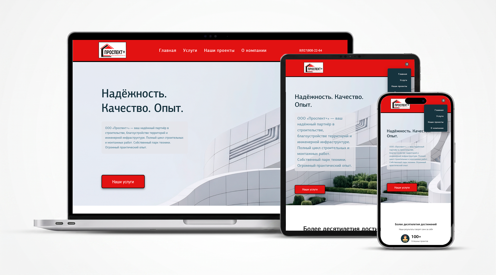

# Лендинг строительной компании "Проспект+"

**Главная страница/Страница "О компании"/Страница проектов**

## 👀 Посмотреть сайт
**[Открыть демо](https://vrust00.github.io/Construction-Company-Prospekt-Plus/)**

## Что за проект
Вёрстка адаптивного лендинга для строительной компании "Проспект+" по бесплатному макету из Figma.  
На странице есть шапка, блок с услугами, примеры проектов, адрес офиса на карте и контакты.

## Какие технологии использовал
- HTML5
- CSS3 (Flexbox, Grid)
- SCSS — препроцессор для удобной работы со стилями
- Figma
- Yandex Maps
- JavaScript (меню-бургер, открывающееся "подробнее")

## Что получилось
- Корректно выглядит на телефонах, планшетах и больших экранах
- Семантическая разметка
- Придерживался методологии БЭМ в названиях классов
- Встроенная карта с адресом офиса
- Плавный скролл по якорным ссылкам
- Все ссылки и меню работают — можно проверить в [демке](https://vrust00.github.io/Construction-Company-Prospekt-Plus/)

**Как выглядит на разных устройствах**  

## Как запустить у себя
1. Склонируйте репозиторий (cmd):  
   `git clone https://github.com/vrust00/Construction-Company-Prospekt-Plus.git`
   
3. Откройте файл `index.html` в любом браузере.

## Контакты для связи со мной
- Telegram: [@j_mkll](https://t.me/j_mkll)
